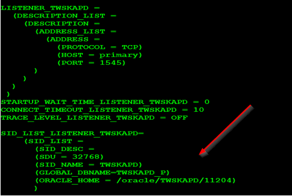
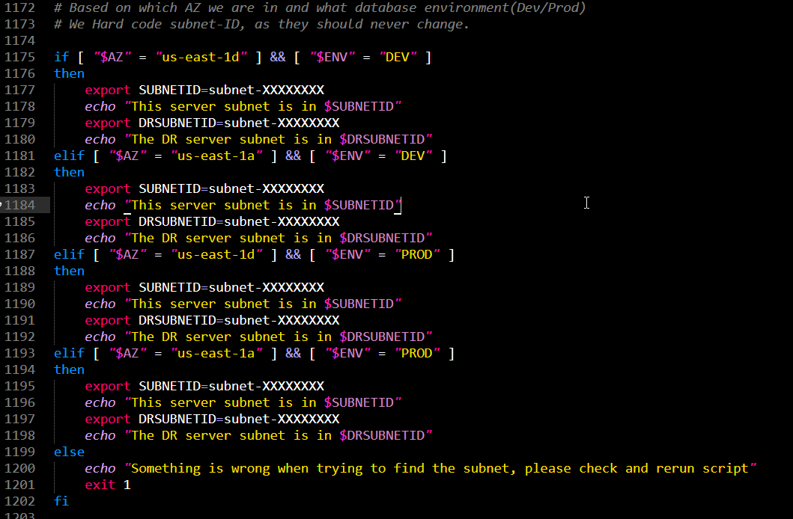

Script is based on "Data Guard Menu - Charles Kim", it has been highly modified to be used in AWS environment.

Script to build out Physical Standby database using Oracle Data Guard in an AWS Environment using EC2 Instance.  This script will create an secondary server(EC2), where the standby database will be in recovery state.  Script assume that secondary host is not yet been created and will be created as part of this script.  Unlike using RMAN to create the secondary database, we use AWS create image API to create image of primary server and using that image we create the secondary server using AWS run instance API.

Requirements: This script depends on whole bunch of sql and shell script present in this folder. Also this script will ask for secondary hostname, IP address, environment type for data guard setup.  So Have those handy if data guard setup is the function you are calling.

This script has been tested on RHEL 6.5-6.8 running oracle version 11.2.0.4-12.1.0.2 and only when one SID is running on the server but with few tweaks it can be adjusted to run against multiple SID as well.

Assumption:
- Run script as oracle user(or user who is part of OS level dba group)
- Server name is set to es1aws* (change this to your company standard)
- Host name is in DNS already exist for secondary server or use /etc/hosts
- Make sure secondary server is not ping-able
- file system expected are
- /oracle/${ORACLE_SID}/standbylog
- /oracle/${ORACLE_SID}/flashrecovery
- listener.ora file entry is expected in certain way.  That is no entries after SID_LIST_LISTENER_NAME block

- listener name is expected as LISTENER_SID
- This script generates 2 additional script so ROOT user can run those script(think of root.sh script).  Have either sudo privileges handy or root password.
- aws cli should be installed at this location /usr/local/aws/bin/aws
- Make sure this instance has outbound connection to make API calls to AWS @ ec2.us-east-1.amazonaws.com:443
- This will only work on non-asm oracle database

Special Notes:
This script is designed to only work at AWS AZ level setup but can be easily be modified to be used at region level.  This script assumes the below when it comes to different DR subnet at AZ level.

we have 4 subnet in 2 different AZ(1d and 1a).  If we are deploying DG in production, and our primary server is running in 1d subnet, the script will put the standby database in 1a subnet

1d - dev   
1a - dev

1d - prod  
1a - prod

So change the subnet-id accordingly as show in below screen shot for prod 1d, 1a and dev 1d, 1a 

Change keyname to whatever key you are using to login to your primary/secondary server.

# Detail doc available under Step-Step-Doc folder

AWS Policy used by these script should have following allowed: 

- ec2 run-instances
- ec2 describe-tags
- ec2 describe-volumes
- ec2 create-image
- ec2 describe-images
- ec2 describe-instance-status
- ec2 modify-instance-attribute
- ec2 describe-instances
- ec2 terminate-instances
- ec2 delete-volume
